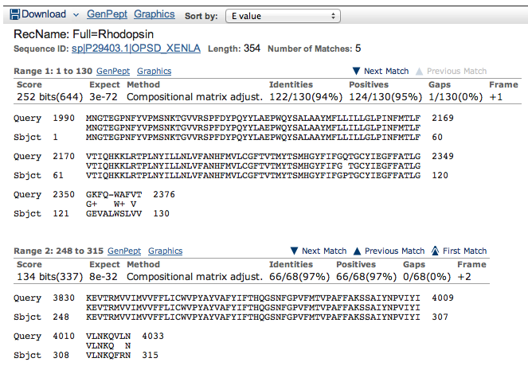

## Résultats Années 2000



### Retranscription par ChatGPT
 
```
> Query Frame +1
MNGTEGPNFYVPMSNKTGVVRSPFDYVIYAYMFAYVAAWYMIFLIIGFPINFLT
YQIEKHKFCLFGTPIYMIVFIVCMLLITLFGYVCYFITEYFATL
GFKQ-WAFTV

> Sbjct Frame +1
MNGTEGPNFYVPMSNKTGVVRSPFDYVIYAYMFAYVAAWYMIFLIIGFPINFLT
YQIEKHKFCLFGTPIYMIVFIVCMLLITLFGYVCYFITEYFATL
GVEIALWSLVV

> Query Frame +2
KEVTRMVIIMVFFLICWVPYAGFAAAGFTN
VLNKQVLRN

> Sbjct Frame +2
KEVTRMVIIMVFFLICWVPYAGFAAAGFTN
VLNKQFRN
```


## Résultats 2025

Sur la Frame +2 uniquement.


```
Query  110   MNGTEGPNFYVPMSNKTGVVRSPFDYPQYYLAEPWQYSALAAYMFLLILLGLPINFMTLF  289
             MNGTEGPNFYVPMSNKTGVVRSPFDYPQYYLAEPWQYSALAAYMFLLILLGLPINFMTLF
Sbjct  1     MNGTEGPNFYVPMSNKTGVVRSPFDYPQYYLAEPWQYSALAAYMFLLILLGLPINFMTLF  60

Query  290   VTIQHKKLRTPLNYILLNLVFANHFMVLCGFTVTMYTSMHGYFIFGQTGCYIEGFFATLG  469
             VTIQHKKLRTPLNYILLNLVFANHFMVLCGFTVTMYTSMHGYFIFG TGCYIEGFFATLG
Sbjct  61    VTIQHKKLRTPLNYILLNLVFANHFMVLCGFTVTMYTSMHGYFIFGPTGCYIEGFFATLG  120

Query  470   GEVALWSLVVLAVERYMVVCKPMANFRFGENHAIMGVAFTWIMALSCAAPPLFGWSRYIP  649
             GEVALWSLVVLAVERY+VVCKPMANFRFGENHAIMGVAFTWIMALSCAAPPLFGWSRYIP
Sbjct  121   GEVALWSLVVLAVERYIVVCKPMANFRFGENHAIMGVAFTWIMALSCAAPPLFGWSRYIP  180

Query  650   EGMQCSCGVDYYTLKPEVNNESFVIYMFIVHFTIPLIVIFFCYGRLLCTVkeaaaqqqes  829
             EGMQCSCGVDYYTLKPEVNNESFVIYMFIVHFTIPLIVIFFCYGRLLCTVKEAAAQQQES
Sbjct  181   EGMQCSCGVDYYTLKPEVNNESFVIYMFIVHFTIPLIVIFFCYGRLLCTVKEAAAQQQES  240

Query  830   attqkaeKEVTRMVVIMVVFFLICWVPYAYVAFYIFTHQGSNFGPVFMTVPAFFAKSSAI  1009
              TTQKAEKEVTRMVVIMVVFFLICWVPYAYVAFYIFTHQGSNFGPVFMTVPAFFAKSSAI
Sbjct  241   LTTQKAEKEVTRMVVIMVVFFLICWVPYAYVAFYIFTHQGSNFGPVFMTVPAFFAKSSAI  300

Query  1010  YNPVIYIVLNKQFRNCLITTLCCGKNPFGDEDG  1108
             YNPVIYIVLNKQFRNCLITTLCCGKNPFGDEDG
Sbjct  301   YNPVIYIVLNKQFRNCLITTLCCGKNPFGDEDG  333


Query  830   KEVTRMVVIMVVFFLICWVPYAYVAFYIFTHQGSNFGPVFMTVPAFFAKSSAI  1009
             KEVTRMVVIMVVFFLICWVPYAYVAFYIFTHQGSNFGPVFMTVPAFFAKSSAI
Sbjct  241   KEVTRMVVIMVVFFLICWVPYAYVAFYIFTHQGSNFGPVFMTVPAFFAKSSAI  300

Query  1010  YNPVIYIVLNKQFRNCLITTLCCGKNPFGDEDG  1108
             YNPVIYIVLNKQFRNCLITTLCCGKNPFGDEDG
Sbjct  301   YNPVIYIVLNKQFRNCLITTLCCGKNPFGDEDG  333
```

```
>NM_001087048.2 Xenopus laevis rhodopsin L homeolog (rho.L), mRNA
GTAGAACAGCTTCAGTTGGGATCACAGGCTTCTAAGGATCCTTTGGGCAAAAAAGAAACAGAGAAGGCAT
TCTTTCTATACAAGAAAGGACTTGATAGAGCTGCTACCATGAACGGAACAGAGGGTCCCAATTTTTATAT
CCCCATGTCCAACAAAACTGGGGTGGTACGAAGCCCATTCGATTACCCTCAGTATTACTTAGCAGAGCCA
TGGCAATATTCAGCACTGGCTGCTTACATGTTCCTGCTCATCCTGCTTGGGTTACCAATCAACTTCATGA
CCTTGTTTGTTACCATCCAGCACAAGAAACTCAGAACACCCCTAAACTACATCCTGCTGAACCTGGTATT
TGCCAATCACTTCATGGTCCTGTGTGGGTTCACGGTGACAATGTACACCTCAATGCACGGCTACTTCATC
TTTGGCCAAACTGGTTGCTACATTGAAGGCTTCTTTGCTACACTTGGTGGTGAAGTGGCCCTCTGGTCAC
TGGTAGTATTGGCCGTTGAAAGATATATGGTGGTCTGCAAGCCCATGGCCAACTTCCGATTCGGGGAGAA
CCATGCTATCATGGGTGTAGCCTTCACATGGATCATGGCTTTGTCTTGTGCTGCTCCTCCTCTATTTGGA
TGGTCCAGATACATCCCAGAGGGAATGCAATGCTCATGCGGAGTAGACTACTACACACTGAAGCCTGAGG
TCAACAATGAATCCTTTGTTATCTACATGTTCGTTGTCCACTTCACCATTCCCCTGATTGTCATCTTCTT
CTGCTATGGCCGCCTGCTCTGCACTGTCAAAGAGGCTGCAGCCCAGCAACAGGAATCTGCTACCACCCAG
AAGGCTGAGAAAGAGGTCACCAGAATGGTTGTTATCATGGTCGTTTTCTTCCTGATCTGTTGGGTGCCCT
ATGCCTATGTGGCATTCTACATCTTCACCCACCAGGGCTCCGACTTTGGCCCAGTCTTCATGACTGTCCC
AGCTTTCTTTGCCAAGAGCTCTGCTATCTACAATCCTGTCATCTACATTGTTTTGAACAAACAGTTCCGT
AACTGCTTGATCACCACCCTGTGCTGTGGAAAGAATCCATTCGGTGATGAAGATGGCTCCTCTGCAGCCA
CCTCCAAGACAGAAGCTTCTTCTGTCTCTTCCAGCCAGGTGTCTCCTGCATAAGAGCTTCACCAGGGCTG
TCTCAGGGTCCGCTGCCTCACACAATTCCCATCACTTAAGCCCTGTCTACTTGTTGCGAAGGCAAAGGAT
TCCACAGTTTTAATGTTTACCCCCATTCTGCCCAACCTTGGACACTGTAAGAGCTGACCCCATTACTGCT
GGGAAGGCCCAAGCTTTGTTGCATTCTGATGTGATCCTTTCAGCAGAAAATGGGTGGATTCAATGAATTT
CACCAAGGCTGTACATAACAATACCATTAGTTTCAAGGCACCTCCCACCAGGAGAATGCAACACTTATTT
ATCTCTGTCTTTTCTTGAAGCTGACATATTGATGCTGCTTCTATTCATGGTCAGTAACAAAAAGTCCCAT
TTTACAATGCAACTGAAAGTAATATTTTTTATGTAATATAATAACATATTTCATGCAATCTCCTCTGCTT
ATTGGCAAGGTCTGATATAGTGAAGATAGACAGTCAGACCCCTTGCATTAAAATCCTGTATTAAAAATGT
CTTTGCAAGTAAAAAACCCCAAAAAAAAAAAAAAAAAAAAAAAAAAAAAAA
```

### Build graph


```bash
egrep -o '(##\s+[0-9]*|LINK\,[0-9]*|GAMEOVER|BACK)' source.md 
```
