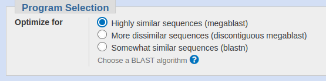

## 1


Une post-doc a travaillé sur un projet de bio-informatique mais n'a pas eu le temps de le terminer. Elle a simplement envoyé une capture d'écran à son directeur.

En tant que stagiaire, le directeur de labo vous a demandé de recommencer ce travail pour vérifier que le résultat donné est le bon. Le document vous a été envoyé par mail et vous pouvez le consulter dans votre inventaire $[ITEM.SET,RESULT,1].

Saurez-vous relever le défi?


Vous décidez de retouner dans son bureau pour trouver des indices sur la manière dont elle a obtenu son résultat. Rendez-vous au $[LINK,2].


---

## 2


Vous regardez son bureau qui est jonché de papiers et des livres de bio-informatique dans un désordre indescriptible. Enfin, sur son bureau trône un écran XXL derrière lequel est collé de nombreux post-its sur le mur.

- A l'idée de fouiller dans ce désordre, cela vous fatigue... Vous allez prendre un café $[LINK,45].
- Vous retroussez vos manches et regardez les notes épinglées au mur, rendez-vous au $[LINK,8].
- Vous décidez de jeter un oeil sur les papiers qui jonchent le bureau, rendez-vous au $[LINK,7].

---

## 3


Après vous êtes connecté sur son ordinateur. Vous hésitez sur la marche à suivre... quels outils bio-informatiques allez-vous utiliser?

- Si vous pensez trouver votre bonheur dans le package `EMBOSS` rendez-vous au $[LINK,71].
- Si vous êtes certain qu'il faut interroger `NCBI Entrez`, rendez-vous au $[LINK,6].
- Si rien ne vaut le `BLAST`, vous jetez votre dévolu sur ce programme, rendez-vous au $[LINK,5].
- Vous ne savez pas par où commencer, vous cherchez la post-doc. Rendez-vous au $[LINK,4].

---
## 4


Par les collègues la connaissant, vous apprenez qu'elle s'appelle _Charlie_. Mais **où est Charlie?**

Après avoir passé des heures à déambuler de bâtiments en bâtiments, vous ne trouvez personne.

Il se fait tard. Depuis longtemps, votre directeur de labo a trouvé un remplaçant pour terminer le projet...

$[GAMEOVER,999]

---
## 5


Sur la page principale de `NCBI BLAST`, vous devez choisir le type de BLAST.

- BLASTn, rendez-vous au $[LINK,10].
- BLASTp, rendez-vous au $[LINK,20].
- BLASTx, rendez-vous au $[LINK,30].
- tBLASTn, rendez-vous au $[LINK,40].
- tBLASTx, rendez-vous au $[LINK,50].

---

## 6

### Moteur de recherche `NCBI Entrez`


- `Literature databases`, rendez-vous au $[LINK,60].
- `Genes`, `Genomes`, `Nucleotides`, rendez-vous au $[LINK,61].
- `Protein`, rendez-vous au $[LINK,62].
- `Clinical`, rendez-vous au $[LINK,64].
- `PubChem`, rendez-vous au $[LINK,65].
- `BLAST`, rendez-vous au $[LINK,67].

???

.small_font[| Section | Description   |
|---------|-----------------|
| Literature databases | Books, Journal articles, Ontology |
| Genes|Gene sequences and annotations used as references for the study of orthologs structure, expression, and evolution|
| Protein|Protein sequences, 3-D structures, and tools for the study of functional protein domains and active sites|
| Genomes|Genome sequence assemblies, large-scale functional genomics data, and source biological samples|
| Clinical|Heritable DNA variations, associations with human pathologies, and clinical diagnostics and treatments|
| PubChem|Repository of chemical information, molecular pathways, and tools for bioactivity screening|
| BLAST | A tool to find regions of similarity between biological sequences |]

---
## 7


Parmi les feuilles, sur le dessus de la pile, vous trouvez une séquence FASTA. Vous la scannez, la transformez en texte et la stockez dans votre inventaire $[ITEM.SET,FASTA,2]. 

&mdash; _"Il s'agit sûrement de la séquence à traiter!!! Il ne reste plus qu'à trouver comment reproduire le résultat attendu."_ 

Vous continuez à fouiller le bureau. Rendez-vous au $[LINK,2].

---
## 8

Parmi les notes épinglées au mur, vous en trouvez une avec le code `b10inf@_bl@s7x`. Vous le prenez en photo avec votre smartphone au cas où cela pourrait servir.

- Vous décidez de continuer à fouiller le bureau, rendez-vous au $[LINK,2].

---
## 9


Un prompt clignote et attend un mot de passe...

- Vous n'avez pas le mot de passe, vous décidez de continuer à fouiller le bureau, rendez-vous au $[LINK,2].
- Vous n'avez pas le mot de passe mais vous tentez le coup avec des mots simples. Après tout, tout le monde vous dit que vous êtes le hacker du siècle!!!, rendez-vous au $[LINK,17].
- Tapez le mot de passe si vous l'avez...

$[b10inf@_bl@s7x] $[LINK,3]

---
## 10


- Vous regardez dans les paramètres pour affiner la recherche. Rendez-vous au $[LINK,11]).

---
## 11



Vous devez choisir la variante de `BLASTn`

- Vous êtes pressé, vous choisissez `MEGABLAST`(par défaut) et cliquez sur le bouton bleu `BLAST`. Rendez-vous au $[LINK,19].
- Vous choisissez, `BLASTn`, rendez-vous au $[LINK,12].

---
## 12


- Vous cliquez sur le bouton bleu `BLAST`. Rendez-vous au $[LINK,18].
- Vous voulez modifier la matrice, rendez-vous au $[LINK,13].

---
## 13


Pour affiner la recherche par `BLASTn`, vous décidez de modifier la matrice...

Parmi les choix possibles, vous choisissez la plus simple:

| . | A | C | G | T |
|---|---|---|---|---|
| A | 1 |-2 |-2 |-2 |
| C |-2 | 1 |-2 |-2 | 
| G |-2 |-2 | 1 |-2 | 
| T |-2 |-2 |-2 | 1 | 

- Vous cliquez sur le bouton bleu `BLAST`. Rendez-vous au $[LINK,14].

---
## 14


$[LINK,15]

---
## 15


$[LINK,16]

---
## 16


Le résultat est prometteur, vous avez trouvé un mRNA de rhodopsin chez _Xenopus_. Mais, si vous regardez bien le travail commencé par la bio-informaticienne, elle n'a pas exactement le même type de données $[LINK,70]...

Vous êtes proche, mais ce n'est pas encore ça!!

- Vous décidez d'essayer un autre `BLAST`. Rendez-vous au $[LINK,5].
- Vous décidez d'essayer un autre outil bioinformatique, rendez-vous au $[LINK,3].

---
## 17


&mdash; `0000`

&mdash; `1234`

&mdash; `universite_b0rdeaux`

Après trois tentatives, l'ordinateur se bloque, l'écran devient noir et vous entendez les ventilateurs de l'ordinateur qui s'emballent!!! Rendez-vous au $[LINK,55].

---
## 18

Le blastn avec les paramètres par défaut...

Vous décidez de changer...

- les paramètres du `BLASTn`, rendez-vous au $[LINK,13].
- de `BLAST`, rendez-vous au $[LINK,5].
- d'outils bioinformatiques, rendez-vous au $[LINK,2].

---
## 19


Le `megablast` est super rapide!!!

- Vous souhaitez regarder les résultats, rendez-vous au $[LINK,14].
- C'est un peu trop rapide à votre goût et vous voulez améliorer les résultats, rendez-vous au $[LINK,11].

---
## 20


Vous collez la séquence, renommez le `job` _crazybiocomputing_ et hop!, vous lancez le BLAST en cliquant sur le bouton bleu.

Voilà du travail vite fait, bien fait. Rendez-vous au $[LINK,25].

- Vous décidez de prendre votre temps et de regarder les paramètres en détail, rendez-vous au $[LINK,22].

---
## 21

---
## 22

- Vous décidez de choisir une Banque de Données pour restreindre la recherche... et gagner du temps, rendez-vous au $[LINK,24].
- Vous décidez de changer la matrice de substitution, rendez-vous au $[LINK,26].

---
## 23


Vous lancez le `BLAST` en cliquant sur le bouton bleu. Rendez-vous au $[LINK,28].

---
## 24

### Changement de la banque de données 

Vous décidez de prendre uniquement **UniprotKB/Swiss-Prot**


- Vous décidez de changer la matrice de substitution, rendez-vous au $[LINK,26].
- Vous lancez le BLAST. Rendez-vous au $[LINK,23].
---
## 25

...Vite fait... **mal** fait. Un message d'erreur s'affiche!! 


- Vous vous êtes sûrement trompé dans les paramètres. Rendez-vous au $[LINK,22].
- Vous voulez essayer un autre BLAST, rendez-vous au $[LINK,5].
- Vous laissez tomber et choisissez de trouver un autre programme, peut-être dans `EMBOSS`, rendez-vous au $[LINK,3].

---
## 26

Vous décidez de prendre la matrice **BLOSUM62** et vous vérifiez si elle est bien sélectionnée dans les paramètres.


- Vous décidez de changer la banque de données, rendez-vous au $[LINK,26].
- Vous lancez le BLAST. Rendez-vous au $[LINK,23].

---
## 27

---
## 28


Malgré votre configuration du `BLAST`, un message d'erreur s'affiche!! 


- Vous vous êtes sûrement trompé dans les paramètres. Rendez-vous au $[LINK,22].
- Vous voulez essayer un autre BLAST, rendez-vous au $[LINK,5].
- Vous laissez tomber et choisissez de trouver un autre programme, peut-être dans `EMBOSS`, rendez-vous au $[LINK,3].


---
## 29


| Name | Accession | Description | Interval | E-value | 
|------|-----------|-------------|----------|---------|
| 7tmA_MWS_opsin | cd15080 | medium wave-sensitive opsins...| 221-1060 |3.83e-172 |
| 7tm_1 | pfam00001 | 7 transmembrane receptor (rhodopsin family)...| 272-1027 | 2.14e-25 |
| Rhodopsin_N | pfam10413 | Amino terminal of the G-protein receptor rhodopsin ... | 116-220 | 1.81e-16 |
| PHA03087 | PHA03087 | G protein-coupled chemokine receptor-like protein ... | 248-1048 | 2.29e-11 | 

Parmi les 4 possibles, le 1er a la E-value la plus faible... Et c'est donc une _medium wave-sensitive opsin_ C'est impliqué dans la vision !?! Vous retournez au paragraphe précédent $[BACK].

---
## 30


- Vous décidez de continuer, rendez-vous au $[LINK,31].
- Vous voulez essayer un autre outil bio-informatique, rendez-vous au $[LINK,3].
- Vous voulez essayer un autre `BLAST`, rendez-vous au $[LINK,5].

---
## 31


Pour accélérer la recherche, vous vous limitez à la banque de données `UniprotKB`. 

Vous continuez le paramétrage, rendez-vous au $[LINK,32].

---
## 32


Vous cliquez sur `Algorithm parameters` et choisissez la matrice de substitution `BLOSUM62`. Vous décidez de ne pas toucher aux pénalités de gaps.

Rendez-vous au $[LINK,36].

---
## 33


- Si vous souhaitez consulter l'onglet `Description`, rendez-vous au $[LINK,34].
- Si vous souhaitez consulter l'onglet `Graphic Summary`, rendez-vous au $[LINK,37].
- Si vous souhaitez consulter l'onglet `Alignments`, rendez-vous au $[LINK,39].
- Si vous souhaitez consulter l'onglet `Taxonomy`, rendez-vous au $[LINK,35].
- Vous perdez votre temps et décidez de passer à autre chose, rendez-vous au $[LINK,36].

---
## 34

#### Description


Cool! J'ai une identité presque parfaite avec des scores stratosphériques et même une E-value de `0.0`. C'est de la bombe!!!

Pour consulter un autre onglet, rendez-vous au $[LINK,33].

---
## 35

#### Taxonomy


- Les 1er résultats correspondent à des anoures (amphibiens). Rendez-vous sur Wikipedia pour les [Anoures](https://fr.wikipedia.org/wiki/Anoures).
- Pour consulter un autre onglet, rendez-vous au $[LINK,33].

---
## 36


- Vous avez la conviction d'avoir raté quelque chose, vous retournez au bureau. Rendez-vous au $[LINK,2].
- _"C'est stupide!! mais bien sûr!"_ Vous avez tout compris, vous choisissez un autre `BLAST`. Rendez-vous au $[LINK,5].
- Définitivement, vous êtes passé à côté! Rendez-vous au $[LINK,3] pour choisir un autre outil bio-informatique.
- Vous cliquez sur le bouton `BLAST` et croisez les doigts. Rendez-vous au $[LINK,33].


---
## 37

#### Graphic Summary


Il a trouvé que ma séquence &mdash; ou au moins une partie &mdash; appartient à la super-famille des `7tm_GPCRs`.

- _"C'est quoi les `7tm_GPCRs`?"_, vous cliquez sur le schéma. Rendez-vous au $[LINK,29].
- Pour consulter un autre onglet, rendez-vous au $[LINK,33].

---
## 38


OOOOUUUUUIIIIIIIII!!!! Vous avez réussi!!!! Félicitations!!!!!

Devant votre succès, vous avez la vision d'un dragon qui vient vous saluer impressionné par tant d'intelligence et de savoirs!!!

Pour validez le mini-jeu, saisissez le code `famous.php` dans l'URL de votre navigateur web ou cliquez <a href="famous.php">ici</a>.

---
## 39


Oui, c'est exactement cela!!! un alignement de séquences protéiques alors que j'ai donné en _'Query'_ une séquence nucléique. Vous avez pu reproduire la capture d'écran de l'étudiante en bio-informatique.

- _"Hmmm..."_ vous n'êtes pas sûr à 100%... vous décidez de conforter votre opinion et de consulter un autre onglet, rendez-vous au $[LINK,33].
- Vous prenez le risque et vous décidez d'aller voir le directeur de labo. Rendez-vous au $[LINK,38].

---
## 40


- Vous collez la séquence, prenez les paramètres par défaut et hop! c'est parti!! Rendez-vous au $[LINK,41].
- Vous voulez essayer un autre outil bio-informatique, rendez-vous au $[LINK,3].
- Vous voulez essayer un autre `BLAST`, rendez-vous au $[LINK,5].

---
## 41


Arrggghhh! Il y a une erreur!!! Mais pourquoi? Rendez-vous au $[LINK,42].

---
## 42


Mais oui, c'est bien indiqué!!! Le `tBLASTn` recherche les alignements entre une séquence **protéique** contre une **banque de données nucléiques traduite** (en séquences protéiques).

&mdash; _"C'est perdu!!! Jamais, je n'aurais le temps de tout recommencer..."_

$[GAMEOVER,999]

---
## 43

&mdash; _"Oui, Oui, je m'en souviens, elle nous en avait parlé. Ses données se trouvent sur le cloud. Je peux vous les transférer....Hmmmm. Voilà c'est fait! Bon courage pour la suite"_

Vous recevez une notification que le document est bien dans votre inventaire $[ITEM.SET,FASTA,1].

- Votre projet avance bien, vous avez le droit à un petit café, rendez-vous $[LINK,48].
- Vous retournez à son bureau pour utiliser son ordinateur, rendez-vous $[LINK,9].

---
## 44

---
## 45


&mdash; _"Sympa, la pièce!!!"_

- Vous allez prendre un café. Rendez-vous au $[LINK,48].
- Vous allez parler à quelqu'un. Rendez-vous au $[LINK,49].

---
## 46

Derrière les vitres, une chaleur réconfortante vous berce. Vous vous endormez...

Quand vous vous réveillez, il fait nuit noire, vous êtes seule et il est trop tard pour résoudre le problème dans les temps.

$[GAMEOVER,999]

---
## 47

La personne accepte volontiers votre tasse de café et vous engagez la conversation.

&mdash; _"Votre projet est le résultat d'alignement entre deux séquences protéiques. On reconnait aussi différents sytèmes de score pour évaluer la qualité de l'alignement dont le terme `Expect` qui est caractéristique d'un BLAST."_

- Si vous voulez lancer un `BLAST`, rendez-vous au $[LINK,5].

---
## 48


&mdash; _"Mmmhhh... Cela a l'air délicieux."

- Vous allez vous assoir dans un des canapés pour boire votre café tranquillement. Rendez-vous au $[LINK,46].
- Vous boirez le café plus tard $[ITEM.SET,COFFEE], et vous allez parler à quelqu'un. Rendez-vous au $[LINK,49].

---
## 49

Vous vous approchez de quelqu'un pour engager la conversation.

- Vous demandez des informations pour vous dépanner sur votre projet. Rendez-vous au $[LINK,43]
- Vous n'êtes pas si pressé que cela!! Si vous avez une tasse de café, $[LINK.IF,COFFEE,#OK,#KO], rendez-vous au $[LINK,47].

---
## 50


Selon NCBI, 

<i class="bi bi-quote"></i> `tBLASTx` _[...] nucleotide (tr) vs nucleotide (tr) [used] for identifying nucleotide sequences similar to the query based on their coding potential[...]_

&mdash; _"Pourquoi pas?"_ pensez-vous. Rendez-vous au $[LINK,51].

---
## 51


- Vous vous lancez, collez la séquence, prenez les paramètres par défaut et cliquez sur le bouton `BLAST`, rendez-vous au $[LINK,52].
- Vous voulez essayer un autre outil bio-informatique, rendez-vous au $[LINK,3].
- Vous voulez essayer un autre `BLAST`, rendez-vous au $[LINK,5].

---
## 52


C'est long....

Rendez-vous au $[LINK,56]

---
## 53

---
## 54


Aarrrgh!! C'est le plantage. Tout ce temps de perdu!!

- Vous ne vous avouez pas vaincu, vous relancez le `tBLASTx`, rendez-vous au $[LINK,55].
- Vous voulez essayer un autre outil bio-informatique, rendez-vous au $[LINK,3].
- Vous voulez essayer un autre `BLAST`, rendez-vous au $[LINK,5].

---
## 55


Le PC se met à chauffer et soudain, il explose!!!

$[GAMEOVER,999]

---
## 56


Très long....

Rendez-vous au $[LINK,59]

---
## 57

---
## 58

---
## 59


Très très long....

Rendez-vous au $[LINK,54]

---
## 60


Mais qu'est ce que je fais dans cette galère !?! Après des heures à chercher des bons mot-clés sur **MeSH** et **PubMed**, vous vous demandez vraiment ce que vous êtes en train de faire. 

Rendez-vous au $[LINK,66].

---
## 61

Une intuition vous traverse l'esprit. Vous calculez la longueur de la séquence en Python

```python
print(len(seq) - seq.count('\n'))
```

Vous trouvez une longueur de séquence de <kbd>1684</kbd>. Vous choisissez comme critère la longueur de séquence et essayez sur toutes les banques nucléiques `Nucleotides`, `Genomes` et `Genes`.

&mdash; _"On ne sait jamais, sur un malentendu..."_ vous dites-vous.

Rendez-vous au $[LINK,63].

---
## 62

- `Protein`, rendez-vous au $[LINK,62]

---
## 63


Sur `Nucléotides`, le nombre de résultats est trop important!!! et c'est pareil sur les autres banques nucléiques... Vous ne pouvez rien en faire.

Rendez-vous au $[LINK,66].

---
## 64

- `Clinical`, rendez-vous au $[LINK,64]

---
## 65

- `PubChem`, rendez-vous au $[LINK,65]

---
background-image: url(assets/Leonardo_Anime_alone_in_the_dark_v2.jpg)

.white[
## 66

Tout le monde est parti, vous êtes seul.e dans la pièce. Dans la nuit noire, la lumière de la ville forme des ombres menaçantes dans l'open-space. Dans ce silence sidéral, vous entendez un bruit suspect dans le bâtiment, vous apercevez un autre poste allumé, vous vous approchez.

La post-doc est là parfaitement immobile tel un fantôme pendant que des lignes de code défilent sur son écran.

<i class="bi bi-quote"></i>_Je ne peux pas compter sur vous_ dit-elle d'une voix caverneuse.

C'est la panique!!!! Vous vous enfuyez!!!

$[GAMEOVER,999]
]

---
## 67

<i class="bi bi-quote"></i> _A tool to find regions of similarity between biological sequences_ <i class="bi bi-quote"></i>

&mdash; Cela semble intéressant pour ma séquence inconnue...

Rendez-vous au $[LINK,5].

| Tool | Description | 
|------|-------------|
| blastn | Search nucleotide sequence databases |
| blastp | Search protein sequence databases | 
| blastx | Search protein databases using a translated nucleotide query |
| tblastn | Search translated nucleotide databases using a protein query | 

???

| Tool | Description | 
|------|-------------|
| blastn | Search nucleotide sequence databases |
| blastp | Search protein sequence databases | 
| blastx | Search protein databases using a translated nucleotide query |
| tblastn | Search translated nucleotide databases using a protein query | 


---
## 68

---
## 69

---
## 70


Retournez au paragraphe précédent $[BACK,-1].

---
## 71


&mdash; _"Vous voulez utiliser EMBOSS?"_ demande le jeune homme qu'on vous a indiqué comme expert en bio-informatique. Si oui, rendez-vous au $[LINK,72].

&mdash; _"Si vous voulez de la documentation, je peux vous la fournir"_ dit-il sur un ton aimable. Rendez-vous au $[LINK,73].

Finalement, vous pensez que ce n'est pas un bon choix, vous retournez au $[LINK,3].

---
## 72

&mdash; _"Si on regarde bien votre séquence, elle est nucléique car ne contient que les lettres <kbd>a</kbd>, <kbd>c</kbd>, <kbd>g</kbd> et <kbd>t</kbd>"_ vous dit l'expert en pointant son doigt sur la feuille de papier.

&mdash; _"Or, le résultat intermédiaire de la bio-informaticienne est un alignement de séquence protéique"_ vous suivez-vous? Vous hochez la tête perplexe.

&mdash; _"Donc, une étape possible est de traduire cette séquence nucléique en séquence protéique selon les six cadres de lecture pour n'omettre aucune solution possible."_

- Si vous continuez avec `EMBOSS`, rendez-vous au $[LINK,79].
- Si vous renoncez, retournez à $[LINK,3] pour essayer une autre approche.

---
## 73


&mdash; _"C'est un package de bio-informatique un peu daté et je n'ai qu'une doc papier"_ s'excuse t-il en vous montrant la liasse de feuilles à côté d'un téléphone préhistorique.

Prenant votre courage à deux mains, vous consultez la [liste des outils bioinformatiques EMBOSS](https://crazybiocomputing.github.io/list_emboss.html)". Après une heure à lire, vous avez quelques idées. Rendez-vous au $[LINK,75].


---
## 74


- Si vous choisissez `needle`(Alignement global), rendez-vous au $[LINK,76].
- Si vous choisissez `water`(Alignement local), rendez-vous au $[LINK,78].
---
## 75


Parmi tous les outils, il y a les programmes d'alignements `needle` et `water` qui vous paraissent intéressants. 

Rendez-vous au $[LINK,74].

---
## 76

Pour `needle`, vous collez la séquence inconnue mais dans l'autre champ texte, vous collez quoi? 

&mdash; _"Ah oui, je n'ai rien à mettre, ce n'est pas cela du tout du tout.... je suis complètement perdu!!!"_ pensez-vous.

- Si vous voulez essayer avec `water`, rendez-vous au $[LINK,78].
- Si vous voulez retourner à la doc d'EMBOSS, rendez-vous au $[LINK,77].
---
## 77


Après des heures et des heures passées sur la doc, vous ne trouvez rien de rien. Il est tellement tard que votre directeur a sûrement trouvé quelqu'un d'autre pour finir le projet.

Vous vous retrouvez à déambuler dans un paysage crépusculaire d'outre-tombe sous une pleine lune moqueuse.

$[GAMEOVER,999]

---
## 78


Pour `water`, vous collez la séquence inconnue mais dans l'autre champ texte, vous collez quoi? 

&mdash; _"Ah oui, je n'ai rien à mettre, ce n'est pas cela du tout du tout.... je suis complètement perdu!!!"_ dites-vous.

- Si vous voulez essayer avec `needle`, rendez-vous au $[LINK,76].
- Si vous voulez retourner à la doc d'EMBOSS, rendez-vous au $[LINK,77].
---
## 79

Il y a deux outils de traduction dans `EMBOSS`

- `sixpack`. Rendez-vous au $[LINK,80].
- `transeq`. Rendez-vous au $[LINK,81].
---

## 80

Vous collez la séquence nucléique et cliquez sur le bouton `Run`... Le résultat donne bien 6 séquences. 

<pre style="font-size: 8px">
Output file   outseq

    >sequence_1_ORF1  Translation of sequence in frame 1, ORF 1, threshold 500, 11aa
    GRTASVGITGF
    >sequence_2_ORF1  Translation of sequence in frame 2, ORF 1, threshold 500, 390aa
    VEQLQLGSQASRDPLGKKEKQKAFFLYKKGLYRAATMNGTEGPNFYVPMSNKTGVVRSPF
    DYPQYYLAEPWQYSALAAYMFLLILLGLPINFMTLFVTIQHKKLRTPLNYILLNLVFANH
    FMVLCGFTVTMYTSMHGYFIFGQTGCYIEGFFATLGGEVALWSLVVLAVERYMVVCKPMA
    NFRFGENHAIMGVAFTWIMALSCAAPPLFGWSRYIPEGMQCSCGVDYYTLKPEVNNESFV
    IYMFIVHFTIPLIVIFFCYGRLLCTVKEAAAQQQESATTQKAEKEVTRMVVIMVVFFLIC
    WVPYAYVAFYIFTHQGSNFGPVFMTVPAFFAKSSAIYNPVIYIVLNKQFRNCLITTLCCG
    KNPFGDEDGSSAATSKTEASSVSSSQVSPA
    >sequence_4_ORF1  Translation of sequence in frame 4, ORF 1, threshold 500, 26aa
    LAKKFLIQDFNARGLAVYPHYIRPCQ
    >sequence_5_ORF1  Translation of sequence in frame 5, ORF 1, threshold 500, 10aa
    TCKEIFNTGF
    >sequence_6_ORF1  Translation of sequence in frame 6, ORF 1, threshold 500, 5aa
    LQRNF
</pre>

- Si vous voulez lancer un `BLASTp` sur ces séquences, rendez-vous au $[LINK,82].
---

## 81

Vous collez la séquence nucléique et cliquez sur le bouton `Run`... Le résultat donne bien 6 séquences. 

<pre style="font-size: 8px">
Output file   outseq

    >sequence_1
    GRTASVGITGF*GSFGQKRKTEGILSIQERTL*SCYHERNRRSKFLCPHVQQNWGGTKPIRLPSVLLSRAMAIFSTGCLHVPAHPAWVTNQLHDLVCYHPAQETQNTPKLHPAEPGICQS
    LHGPVWVHGDNVHLNARLLHLWPNWLLH*RLLCYTWW*SGPLVTGSIGR*KIYGGLQAHGQLPIRGEPCYYGCSLHMDHGFVLCCSSSLRMVQIHPRGNAMLMRSRLLHTEA*GQQ*ILC
    YLHVHCPLHHSPDCHLLLLWSPALHCQRGCSPATGICYHPEG*ERGHQNGCYHGRFLPDLLGALCLCGILHLHPPGL*LWPSLHDRPSFLCQELCYLQSCHLHCLEQTVP*LLDHHPVLW
    KESIR**RWLLCSHLQDRSFFCLFQPGVSCIRASPGLSQGPLPHTIPIT*ALSTCCEGKEFHSFNIYPHSAQPWTL*ELTPLLLGRPKLCCILM*SFQQKMGGFNEFHQGCT*Q*H*SEG
    TSHPENATLIYLCLFLTY*CCFYSWSLTKSPILQCN*K*CIFVI**HISCNLLCLLARSDIVRIDSQTPCIKILY*KFLCKX
    >sequence_2
    VEQLQLGSQASRDPLGKKEKQKAFFLYKKGLYRAATMNGTEGPNFYVPMSNKTGVVRSPFDYPQYYLAEPWQYSALAAYMFLLILLGLPINFMTLFVTIQHKKLRTPLNYILLNLVFANH
    FMVLCGFTVTMYTSMHGYFIFGQTGCYIEGFFATLGGEVALWSLVVLAVERYMVVCKPMANFRFGENHAIMGVAFTWIMALSCAAPPLFGWSRYIPEGMQCSCGVDYYTLKPEVNNESFV
    IYMFIVHFTIPLIVIFFCYGRLLCTVKEAAAQQQESATTQKAEKEVTRMVVIMVVFFLICWVPYAYVAFYIFTHQGSNFGPVFMTVPAFFAKSSAIYNPVIYIVLNKQFRNCLITTLCCG
    KNPFGDEDGSSAATSKTEASSVSSSQVSPA*ELHQGCLRVRCLTQFPSLKPCLLVAKAKNSTVLIFTPILPNLGHCKS*PHYCWEGPSFVAF*CDPFSRKWVDSMNFTKAVHNNNISLKA
    PPTQRMQHLFISVFS*HIDAASIHGH*QKVPFYNATESNVFL*YNNIFHAISSAYWQGLI**G*TARPLALKSCIKNFFAS
    >sequence_3
    *NSFSWDHRLLGILWAKKKNRRHSFYTRKDFIELLP*TEQKVQIFMSPCPTKLGWYEAHSITLSIT*QSHGNIQHWLLTCSCSSCLGYQSTS*PCLLPSSTRNSEHP*TTSC*TWYLPIT
    SWSCVGSR*QCTPQCTATSSLAKLVATLKASLLHLVVKWPSGHW*YWPLKDIWWSASPWPTSDSGRTMLLWV*PSHGSWLCLVLLLLSSDGPDTSQRECNAHAE*TTTH*SLRSTMNPLL
    STCSLSTSPFP*LSSSSAMVACSALSKRLQPSNRNLLPPRRLRKRSPEWLLSWSFSS*SVGCPMPMWHSTSSPTRALTLAQSS*PSQLSLPRALLSTILSSTLS*TNSSVTA*SPPCAVE
    RIHSVMKMAPLQPPPRQKLLLSLPARCLLHKSFTRAVSGSAASHNSHHLSPVYLLRRQRIPQF*YLPPFCPTLDTVRADPITAGKAQALLHSDVILSAENGWIQ*ISPRLYITITLV*RH
    LPPRECNTYLSLSFLDILMLLLFMVTNKKSHFTMQLKVMYFCNIITYFMQSPLLIGKV*YSEDRQPDPLH*NPVLKISLQV
    >sequence_4
    LAKKFLIQDFNARGLAVYPHYIRPCQ*AEEIA*NMLLYYKNTLLSVAL*NGTFC**P*IEAASICQEKTEINKCCILWVGGAFRLMLLLCTALVKFIESTHFLLKGSHQNATKLGPSQQ*
    WGQLLQCPRLGRMGVNIKTVEFFAFATSRQGLSDGNCVRQRTLRQPW*SSYAGDTWLEETEEASVLEVAAEEPSSSPNGFFPQHRVVIKQLRNCLFKTM*MTGL*IAELLAKKAGTVMKT
    GPKLEPWWVKM*NAT*A*GTQQIRKKTTMITTILVTSFSAFWVVADSCCWAAASLTVQSRRP*QKKMTIRGMVKWTMNM*ITKDSLLTSGFSV**STPHEHCIPSGMYLDHPKRGGAAQD
    KAMIHVKATPIIAWFSPNRKLAMGLQTTIYLSTANTTSDQRATSPPSVAKKPSM*QPVWPKMK*PCIEVYIVTVNPHRTMK*LANTRFSRM*FRGVLSFLCWMVTNKVMKLIGNPSRMSR
    NM*AASAEYCHGSAK*Y*G*SNGLRTTPVLLDMGT*KFGPSVPFMVAAL*SPFLYRKNAFCFSFLPKGSLEACDPN*SCST
    >sequence_5
    TCKEIFNTGF*CKGSGCLSSLYQTLPISRGDCMKYVIILQKYITFSCIVKWDFLLVTMNRSSINMSRKDRDK*VLHSLGGRCLQTNVIVMYSLGEIH*IHPFSAERITSECNKAWAFPAV
    MGSALTVSKVGQNGGKY*NCGILCLRNK*TGLK*WELCEAADPETALVKLLCRRHLAGRDRRSFCLGGGCRGAIFITEWILSTAQGGDQAVTELFVQDNVDDRIVDSRALGKESWDGHED
    WAKVRALVGEDVECHIGIGHPTDQEENDHDNNHSGDLFLSLLGGSRFLLLGCSLFDSAEQATIAEEDDNQGNGEVDNEHVDNKGFIVDLRLQCVVVYSA*ALHSLWDVSGPSEERRSSTR
    QSHDPCEGYTHNSMVLPESEVGHGLADHHISFNGQYYQ*PEGHFTTKCSKEAFNVATSLAKDEVAVH*GVHCHREPTQDHEVIGKYQVQQDVV*GCSEFLVLDGNKQGHEVDW*PKQDEQ
    EHVSSQC*ILPWLC*VILRVIEWASYHPSFVGHGDIKIWTFCSVHGSSSIKSFLV*KECLLFFFFAQRIPRSL*SQLKLFYX
    >sequence_6
    LQRNF*YRILMQGVWLSILTISDLANKQRRLHEICYYITKIHYFQLHCKMGLFVSDHE*KQHQYVKKRQR*ISVAFSGWEVPSD*CYCYVQPW*NSLNPPIFC*KDHIRMQQSLGLPSSN
    GVSSYSVQGWAEWG*ILKLWNSLPSQQVDRA*VMGIV*GSGP*DSPGEALMQETPGWKRQKKLLSWRWLQRSHLHHRMDSFHSTGW*SSSYGTVCSRQCR*QDCR*QSSWQRKLGRS*RL
    GQS*SPGG*RCRMPHRHRAPNRSGRKRP**QPFW*PLSQPSGW*QIPVAGLQPL*QCRAGDHSRRR*QSGEW*SGQ*TCR*QRIHC*PQASVCSSLLRMSIAFPLGCIWTIRREEEQHKT
    KP*SM*RLHP**HGSPRIGSWPWACRPPYIFQRPILPVTRGPLHHQV*QRSLQCSNQFGQR*SSRALRCTLSP*THTGP*SDWQIPGSAGCSLGVF*VSCAGW*QTRS*S*LVTQAG*AG
    TCKQPVLNIAMALLSNTEGNRMGFVPPQFCWTWGHKNLDLLFRSW*QLYKVLSCIERMPSVFLFCPKDP*KPVIPTEAVLP
</pre>

- Les étoiles sont des codons STOP et on ne sait pas vraiment quel est le meilleur cadre de lecture. Vous décidez de faire un script Python pour nettoyer ce résultat de facçon élégante. Rendez-vous au $[LINK,86].
- Vous décidez d'utiliser la force brute et d'aller vite. Au pire, vous reviendrez sur la 1ère méthode. Rendez-vous au $[LINK,82].

---

## 82


Les séquences sont protéiques. Vous collez donc les six séquences dans NCBI Blastp, vous choisissez la banque de données 'UniprotKB/Swissprot' et vous cliquez sur le bouton `BLAST`. Rendez-vous au $[LINK,90].
---

## 83

C'est simple, je choisis un `BLASTp` pour rechercher s'il y a une similarité de séquence avec la banque de données `UniprotKB/swissprot`.

Vous collez la séquence nettoyée du 2ème cadre de lecture, choisissez la banque de données et c'est parti!!! 

Rendez-vous au $[LINK,85].

---

## 84

&mdash; _"Vous avez fini! Félicitations"_ dit l'expert en bio-informatique.

&mdash; _"Vous êtes passé par une traduction via EMBOSS et un BLASTp... Hmmm... Effectivement, cela fonctionne mais c'est un peu compliqué."_

&mdash; _"Le plus simple est de lancer un BLASTx qui fait la traduction selon les 6 cadres de lecture automatiquement'"_ s'amuse l'expert de votre confusion.

- Si vous voulez voir le résultat avec un `BLASTx`, rendez-vous au $[LINK,30].
- Il se fait tard, vous décidez de quitter le labo avec le résultat bien en vue pour montrer le résultat à votre directeur de labo. Rendez-vous au $[LINK,38].


---

## 85
Et voilà!! Ca marche!!! C'est exactement cela!!! Vous êtes un génie!!! Rendez-vous au $[LINK,84].

---

## 86

&mdash; _"On décide d'être astucieux... Je vais chercher les séquences qui ont trop de codons 'STOP' symbolisés par l'étoile <kbd>*</kbd> avec un petit programme Python"_ pensez-vous.

Vous scindez les séquences en fonction du chevron <kbd>&gt;</kbd> et pour chacune d'elles, vous recherchez avec la méthode `find()` l'indice de la première étoile rencontrée (_aka_ la première occurrence). 

Ici, vous faites l'hypothèse que la plus longue séquence commence bien au début du cadre de lecture ce qui n'est pas sûr. Mais vous prenez le risque... au pire, vous améliorerez le script.

&mdash; _"Et voilà "_ vous exclamez-vous fier devant votre écran. 


```python
# `seqs` contains the multi-FASTA as a multiline String

# Split String according to its
prots = seqs.split('>')

# For each protein sequence
for prot in prots:
    k = prot.find('*')
    print(k,len(prot),prot[:k])
```

Rendez-vous au $[LINK,87] pour voir le résultat.

---

## 87

Génial!! Seule la séquence du second cadre de lecture donne un résultat convaincant, les autres sont soit trop courts soit ne donne rien. 
```
-1 0 
22 583 sequence_1
GRTASVGITGF
407 582 sequence_2
VEQLQLGSQASRDPLGKKEKQKAFFLYKKGLYRAATMNGTEGPNFYVPMSNKTGVVRSPF
DYPQYYLAEPWQYSALAAYMFLLILLGLPINFMTLFVTIQHKKLRTPLNYILLNLVFANH
FMVLCGFTVTMYTSMHGYFIFGQTGCYIEGFFATLGGEVALWSLVVLAVERYMVVCKPMA
NFRFGENHAIMGVAFTWIMALSCAAPPLFGWSRYIPEGMQCSCGVDYYTLKPEVNNESFV
IYMFIVHFTIPLIVIFFCYGRLLCTVKEAAAQQQESATTQKAEKEVTRMVVIMVVFFLIC
WVPYAYVAFYIFTHQGSNFGPVFMTVPAFFAKSSAIYNPVIYIVLNKQFRNCLITTLCCG
KNPFGDEDGSSAATSKTEASSVSSSQVSPA
11 582 sequence_3

37 582 sequence_4
LAKKFLIQDFNARGLAVYPHYIRPCQ
21 583 sequence_5
TCKEIFNTGF
16 582 sequence_6
LQRNF
```

Rendez-vous au $[LINK,83].

---
## 88

---
## 89


Résultat du blastp 2ème cadre de lecture...

---
## 90


Toutes les séquences ont été évaluées dans la même requête et on peut voir chacun des résultats dans le menu déroulant 

- Pour le résultat du `BLASTp` concernant le premier cadre de lecture, rendez-vous au $[LINK,91].
- Pour le résultat du `BLASTp` concernant le second cadre de lecture, rendez-vous au $[LINK,92].
- Pour le résultat du `BLASTp` concernant le troisième cadre de lecture, rendez-vous au $[LINK,93].
- Pour le résultat du `BLASTp` concernant le quatrième cadre de lecture, rendez-vous au $[LINK,94].
- Pour le résultat du `BLASTp` concernant le cinquième cadre de lecture, rendez-vous au $[LINK,95].
- Pour le résultat du `BLASTp` concernant le sixième cadre de lecture, rendez-vous au $[LINK,96].

&mdash; _"C'est trop long, j'abandonne!!!"_ Rendez-vous au $[LINK,3].

---
## 91


La séquence du 1er cadre de lecture ne donne rien, retournez au $[LINK,90].

&mdash; _"Oh la, la!!!! c'est trop compliqué et cela me prend du temps!!!"_ pensez-vous. Retournez pour essayer une autre approche au $[LINK,3].

---
## 92


La séquence du 2ème cadre de lecture donne quelque chose... mais est-ce vraiment intéressant? Vous décidez de voir les autres solutions, retournez au $[LINK,90].

&mdash; _"Oh la, la!!!! c'est trop compliqué et cela me prend du temps!!!"_ pensez-vous. Retournez essayer une autre approche au $[LINK,3].

&mdash; _"Oh la, la!!!! cela vaut peut-être le coup d'aller plus loin?'"_ pensez-vous. Rendez-vous au $[LINK,89].


---
## 93


La séquence du 3ème cadre de lecture ne donne rien, retournez au $[LINK,90].

&mdash; _"Oh la, la!!!! c'est trop compliqué et cela me prend du temps!!!"_ pensez-vous. Retournez pour essayer une autre approche au $[LINK,3].


---
## 94


La séquence du 4ème cadre de lecture ne donne rien, retournez au $[LINK,90].

&mdash; _"Oh la, la!!!! c'est trop compliqué et cela me prend du temps!!!"_ pensez-vous. Retournez pour essayer une autre approche au $[LINK,3].


---
## 95


La séquence du 5ème cadre de lecture ne donne rien, retournez au $[LINK,90].

&mdash; _"Oh la, la!!!! c'est trop compliqué et cela me prend du temps!!!"_ pensez-vous. Retournez pour essayer une autre approche au $[LINK,3].


---
## 96


La séquence du 6ème cadre de lecture ne donne rien, retournez au $[LINK,90].

&mdash; _"Oh la, la!!!! c'est trop compliqué et cela me prend du temps!!!"_ pensez-vous. Retournez pour essayer une autre approche au $[LINK,3].


---
## 97

<pre style="font-size: 8px">
>sequence
ggtagaacagcttcagttgggatcacaggcttctagggatcctttgggcaaaaaagaaaa
acagaaggcattctttctatacaagaaaggactttatagagctgctaccatgaacggaac
agaaggtccaaatttttatgtccccatgtccaacaaaactggggtggtacgaagcccatt
cgattaccctcagtattacttagcagagccatggcaatattcagcactggctgcttacat
gttcctgctcatcctgcttgggttaccaatcaacttcatgaccttgtttgttaccatcca
gcacaagaaactcagaacacccctaaactacatcctgctgaacctggtatttgccaatca
cttcatggtcctgtgtgggttcacggtgacaatgtacacctcaatgcacggctacttcat
ctttggccaaactggttgctacattgaaggcttctttgctacacttggtggtgaagtggc
cctctggtcactggtagtattggccgttgaaagatatatggtggtctgcaagcccatggc
caacttccgattcggggagaaccatgctattatgggtgtagccttcacatggatcatggc
tttgtcttgtgctgctcctcctctcttcggatggtccagatacatcccagagggaatgca
atgctcatgcggagtagactactacacactgaagcctgaggtcaacaatgaatcctttgt
tatctacatgttcattgtccacttcaccattcccctgattgtcatcttcttctgctatgg
tcgcctgctctgcactgtcaaagaggctgcagcccagcaacaggaatctgctaccaccca
gaaggctgagaaagaggtcaccagaatggttgttatcatggtcgttttcttcctgatctg
ttgggtgccctatgcctatgtggcattctacatcttcacccaccagggctctaactttgg
cccagtcttcatgaccgtcccagctttctttgccaagagctctgctatctacaatcctgt
catctacattgtcttgaacaaacagttccgtaactgcttgatcaccaccctgtgctgtgg
aaagaatccattcggtgatgaagatggctcctctgcagccacctccaagacagaagcttc
ttctgtctcttccagccaggtgtctcctgcataagagcttcaccagggctgtctcagggt
ccgctgcctcacacaattcccatcacttaagccctgtctacttgttgcgaaggcaaagaa
ttccacagttttaatatttacccccattctgcccaaccttggacactgtaagagctgacc
ccattactgctgggaaggcccaagctttgttgcattctgatgtgatcctttcagcagaaa
atgggtggattcaatgaatttcaccaaggctgtacataacaataacattagtctgaaggc
acctcccacccagagaatgcaacacttatttatctctgtcttttcttgacatattgatgc
tgcttctattcatggtcactaacaaaaagtcccattttacaatgcaactgaaagtaatgt
atttttgtaatataataacatatttcatgcaatctcctctgcttattggcaaggtctgat
atagtgaggatagacagccagaccccttgcattaaaatcctgtattaaaaatttctttgc
aagt
</pre>

$[BACK]

---

## 98


$[BACK]

---
## 555

Votre personnage dispose des caractéristiques suivantes:

- Force [STA.SET,10]
- Nombre d'actions [TIME.SET,10]

---

## 666 

Votre inventaire est vide.

---

## 667

- [x] Document bio-informatique $[ITEM.SET,RESULT,1]  &mdash; $[LINK,98]

???

1

---

## 668

- [x] La séquence au format FASTA $[ITEM.SET,FASTA,2] &mdash; $[LINK,97]

???

2

---

## 669

- [x] Document bio-informatique $[ITEM.SET,RESULT,1]  &mdash; $[LINK,98]
- [x] La séquence au format FASTA $[ITEM.SET,FASTA,1] &mdash; $[LINK,97]

???

1+2

---

## 670

- [x] Une tasse de café $[ITEM.SET,COFFEE,1]

???

4

---

## 671

- [x] Document bio-informatique $[ITEM.SET,RESULT,1]  &mdash; $[LINK,98]
- [x] Une tasse de café $[ITEM.SET,COFFEE,1]

???

1+4

---

## 672

- [x] La séquence au format FASTA $[ITEM.SET,FASTA,1] &mdash; $[LINK,97]
- [x] Une tasse de café $[ITEM.SET,COFFEE,1]

???

2+4

---

## 673

- [x] Document bio-informatique $[ITEM.SET,RESULT,1]  &mdash; $[LINK,98]
- [x] La séquence au format FASTA $[ITEM.SET,FASTA,1] &mdash; $[LINK,97]
- [x] Une tasse de café $[ITEM.SET,COFFEE,1]

???

1+2+4


---

## 999


